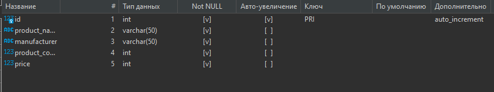

# Домашнее задание №1

Для начала создадим и запольним необходимую таблицу в БД ([Задание 1](create_insert_scrtipt.sql))

Проверим правильность всех типов полей:

> Я использую DBeaver, поэтому такой интерфейс

Далее выполняем остальные задания по порядку:

> Тут только ссылки на скрипты

 - [Задание 2](task_2.sql)
 - [Задание 3](task_3.sql)
 - [Задание 4](task_4.sql)

> 4 Задание тоже отлично работает при полном выполнении скрипта, все 3 запроса как надо отображают